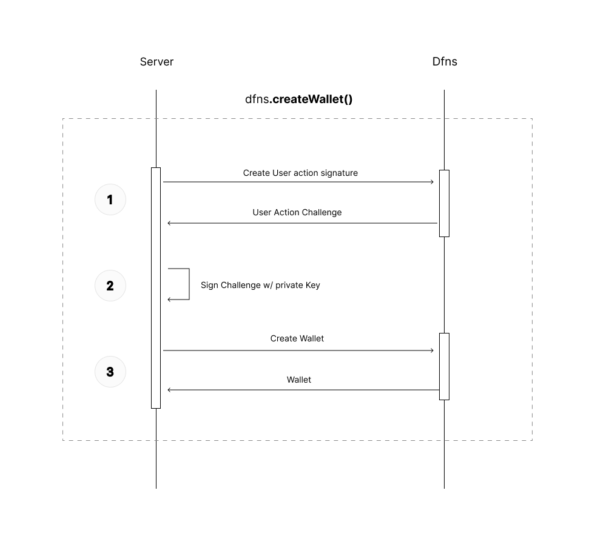

# Dfns Typescript SDK

Welcome 👋 This repo holds the Typescript SDK wrapping [Dfns API](https://www.dfns.co/).

* [Dfns Website](https://www.dfns.co/)
* [Dfns API Docs](https://dfns.gitbook.io/dfns-docs/)


## Usage Server-side (simple)

The simplest configuration to use Dfns API, is using a Service Account from your server (follow [this documentation](TODO) to know more about Service Account creation).

In this configuration, your server also needs to have access to the private key associated with the Service Account you created, since most requests made to Dfns will need to be signed by this key. The

Install Dfns SDK + Dfns Key Signer:
```sh
// using npm
npm i @dfns/sdk @dfns/sdk-key-signer

// using yarn
yarn add @dfns/sdk @dfns/sdk-key-signer
```

Then use it like

```ts
import { DfnsApiClient } from '@dfns/sdk'
import { AsymmetricKeySigner } from '@dfns/sdk-key-signer'
import { BlockchainNetwork } from '@dfns/sdk/codegen/datamodel/Foundations'

const signer = new AsymmetricKeySigner({
  privateKey: process.env.DFNS_PRIVATE_KEY, // private key (credential) registered for your Service Account
  credId: 'X2ktMzhxaTEtZTF1bTgtOXY1cG9yY2tkZDe1dG1jYg', // credential ID of your Service Account
  appOrigin: 'https://app.mycompany.com', // origin added to the (Client-Side) application you are using
})

const client = new DfnsApiClient({
  accessToken: process.env.DFNS_ACCESS_TOKEN, // Service Account token
  appId: 'ap-A3G2-H7-3c562njr9t9679qto6snl5ca8i', // application id
  baseUrl: 'https://api.dfns.io',
  signer,
})

const wallet = await client.wallets.createWallet({ body: { network: BlockchainNetwork.ETH_GOERLI } })

console.log(JSON.stringify(wallet))
```

This Sequence Diagram shows an example of what happens under the hood when using this SDK method `dfns.createWallet()`:



