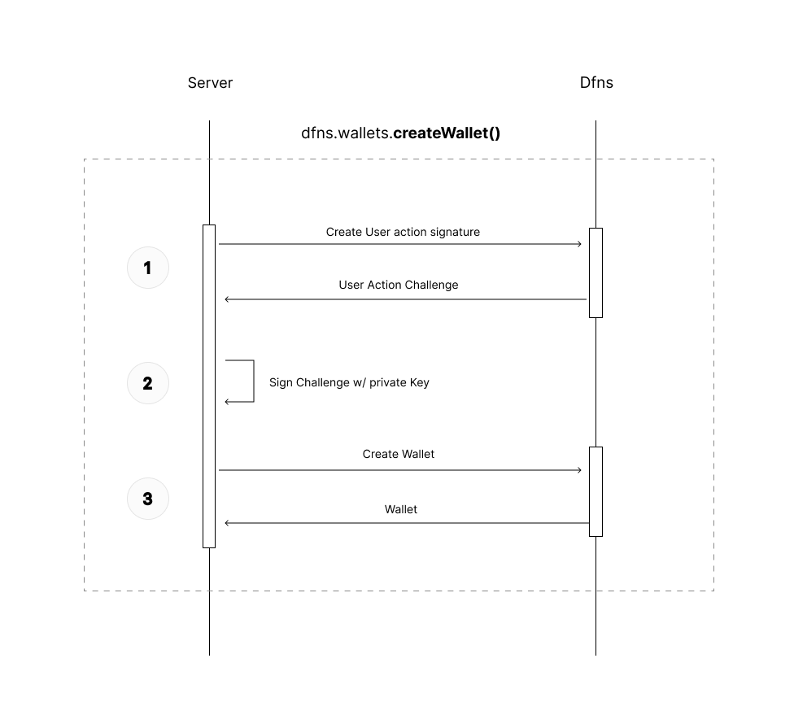

# Dfns typescript SDK

> ⚠️ **This SDK is in alpha**. It may be unstable and have breaking evolutions.

Welcome, builders 👋

This repo holds the Typescript SDK wrapping [Dfns API](https://www.dfns.co/). Useful links:

* [Dfns Website](https://www.dfns.co/)
* [Dfns API Docs](https://dfns.gitbook.io/dfns-docs/)


## Server-side configuration (simple)

The simplest configuration uses a `Service Account` on a server ([check docs](TODO) to know more about Service Account creation).

The server also needs to provide the private key associated with the Service Account (most requests made to Dfns will be signed by this key).

Install `Dfns SDK` + `Dfns Key Signer`:
```sh
// npm
npm i @dfns/sdk @dfns/sdk-key-signer

// yarn
yarn add @dfns/sdk @dfns/sdk-key-signer
```


Here's an example creating a wallet:

```ts
import { DfnsApiClient } from '@dfns/sdk'
import { AsymmetricKeySigner } from '@dfns/sdk-key-signer'
import { BlockchainNetwork } from '@dfns/sdk/codegen/datamodel/Foundations'

const signer = new AsymmetricKeySigner({
  privateKey: process.env.DFNS_PRIVATE_KEY, // private key (credential) registered for your Service Account
  credId: 'X2ktMzhxaTEtZTF1bTgtOXY1cG9yY2tkZDe1dG1jYg', // Credential ID of the Service Account
  appOrigin: 'https://app.mycompany.com', // origin added to the (Client-Side) Application you are using
})

const dfns = new DfnsApiClient({
  baseUrl: 'https://api.dfns.io',
  appId: 'ap-A3G2-H7-3c562njr9t9679qto6snl5ca8i', // Application ID
  accessToken: process.env.DFNS_ACCESS_TOKEN, // Service Account token
  signer, // sdk needs this signer to sign subsequent requests
})

const wallet = await dfns.wallets.createWallet({ body: { network: BlockchainNetwork.ETH_GOERLI } })

console.log(wallet) // 🎉
```

These are requests happening under the hood, when using `dfns.wallets.createWallet()`:



