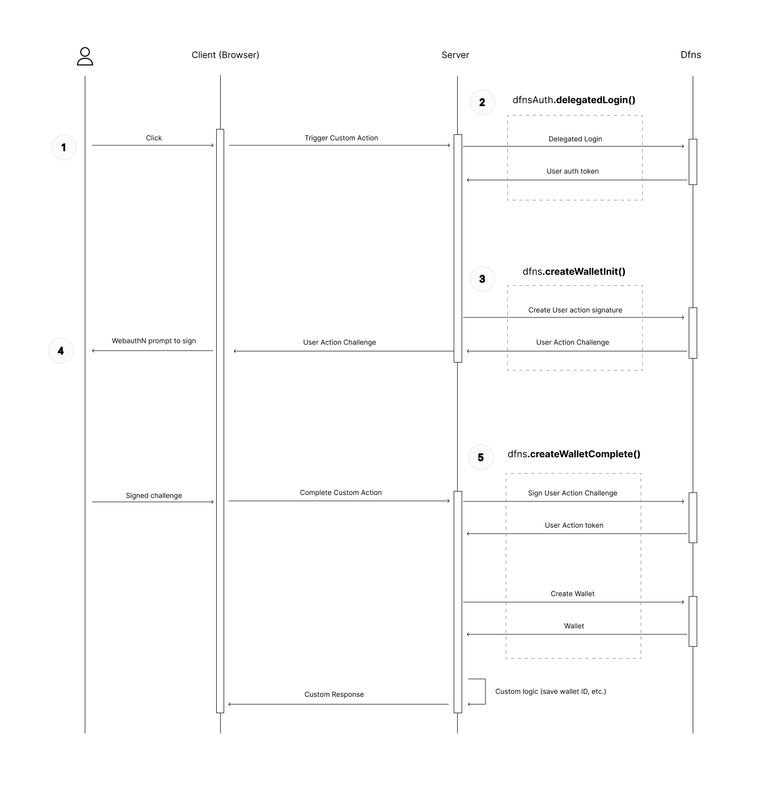

# Dfns SDK example - Nextjs Delegated Auth / Delegated Signing

This example showcases a setup where you have:

- Your server, communicating with Dfns
- A web-app (client-side), where your "end user" lives.

The server is the only party interacting with Dfns API (using the SDK).

In this situation, you (the server) don't want to be "in control" of the user's wallet. Essentially, after a wallet is created, you don't want to be able to initiate a transaction using the user's wallet, without the user signing-off on this action. So because of that, you (the server) shouldn't be legally considered the custodian.

When the server initiates a Wallet creation on behalf of the end-user, the server needs to have the user sign this action, otherwise it won't work.

The end user will sign the action from the web-app, using his WebauthN credentials. Your server will then relay his signature to Dfns, to complete the wallet's creation.

## Prerequisites

To run the example, you must have an active `Application`. To create a new `Application`, go to `Dfns Dashboard` > `Settings` > `Org Settings` > `Applications` > `New Application`, and enter the following information

* Name, choose any name
* Type of User, `Client Side`
* Relying Party = `localhost`
* Origin = `http://localhost:3000`

After the `Application` is created, copy the `App ID`, e.g. `ap-39abb-5nrrm-9k59k0u3jup3vivo`.

You also need a `Service Account`. To create a new `Service Account`, first [generate a keypair](https://docs.dfns.co/dfns-docs/advanced-topics/authentication/credentials/generate-a-key-pair), then go to `Dfns Dashboard` > `Settings` > `Org Settings` > `Service Accounts` > `New Service Account`, and enter the following information,

* Name, choose any name
* Public Key, the public key from the step 'generate a keypair'

After the `Service Account` is created, make sure you copy the account's `authToken`. You won't be able to access the token after you navigate away from the confirmation page.

Go back to the service accounts listing, and the new `Service Account` should be listed there. copy the `Signing Key Cred ID`, e.g. `Y2ktM3E5Y2MtbXFoM20tODdiOW1jNDZqZ2gxYWJqbA`.

Copy `.env.example` to a new file `.env.local` and set the following values,

* `DFNS_API_BASE_URL` = `https://api.dfns.ninja`
* `DFNS_APPLICATION_ID` = the `App ID` from above
* `DFNS_APPLICATION_ORIGIN` = `http://localhost:3000`
* `DFNS_SERVICE_ACCOUNT_CREDENTIAL_ID` = the `Signing Key Cred ID` from above
* `DFNS_SERVICE_ACCOUNT_PRIVATE_KEY` = the private key from the step 'generate a keypair', the newlines should not be a problem
* `DFNS_SERVICE_ACCOUNT_TOKEN` = the `authToken` from above, the value should start with `eyJ0...`
* `NEXT_PUBLIC_DFNS_WEBAUTHN_RPID` = 'localhost'

## Next.js Configuration

To setup your own `Next.js` project, make sure to include the following tweaks in `next.config.js`

* Transpile the WebAuthn package `@dfns/sdk-webauthn`
* Enable multiline environment variable with `dotenv`

```javascript
const result = require('dotenv').config({ path: '.env.local' })

const nextConfig = {
  env: result.parsed,
  transpilePackages: ['@dfns/sdk-webauthn'],
}

module.exports = nextConfig
```

## Run Example

At the root of the dfns-sdk-ts repository (npm workspace), run:
```bash
npm i
```

Then go into this example and install as well:
```bash
cd packages/examples/nextjs-delegated
npm i
```

Then run the development server:
```bash
npm run dev
```

Open [http://localhost:3000](http://localhost:3000) with your browser to see the result, and follow the tutorial.

## Flow



## Server side

Build Dfns client:

```ts
// instanciate a key signer
const signer = new AsymmetricKeySigner({
  appOrigin: process.env.DFNS_APPLICATION_ORIGIN!,
  credId: process.env.DFNS_SERVICE_ACCOUNT_CREDENTIAL_ID!,
  privateKey: process.env.DFNS_SERVICE_ACCOUNT_PRIVATE_KEY!.replace(/\\n/g, '\n'),
})

// instanciate a dfns api client
const dfns = new DfnsApiClient({
  appId: process.env.DFNS_APPLICATION_ID!,
  baseUrl: process.env.DFNS_API_BASE_URL!,
  authToken: process.env.DFNS_SERVICE_ACCOUNT_TOKEN!,
  signer,
})
```

Delegated Login:

```ts
// call delegated login to get the user auth token
const { token: endUserAuthToken } = await dfns.auth.createDelegatedUserLogin({
  body: { username: body.email },
})
```

Wallet creation initiation (wallet owned by end user):

```ts
// instanciate a "delegated" Dfns client
const dfnsDelegated = new DfnsDelegatedApiClient({
    appId: process.env.DFNS_APPLICATION_ID!,
    baseUrl: process.env.DFNS_API_BASE_URL!,
    authToken: endUserAuthToken,
  })

// call wallet creation initiation
const challenge = await dfnsDelegated.wallets.createWalletInit({
  body: { network: BlockchainNetwork.ETH_GOERLI },
})

// send this challenge to be signed by the enduser (client-side).
// ...
```

Complete Wallet creation:

```ts
const body = (await request.json()) as {
  request: CreateWalletRequest
  challenge: UserActionChallengeResponse
  signedChallenge: SignUserActionChallengeRequest
}

// ...

// complete wallet creation
const wallet = await dfnsDelegated.wallets.createWalletComplete(body.request, body.signedChallenge)
```


Get end user wallets:

```ts
const { items: wallets } = await dfnsDelegated.wallets.listWallets({})
```

## Client side

Here's the client-side code for the wallet creation:

```ts
import { WebAuthn } from '@dfns/sdk-webauthn'

const createWallet = () =>
  // 1. Call server-side wallet creation initiation,
  fetch('/api/wallets/create/init', { method: 'POST' }).then(async (result) => {
    const { request, challenge } = await result.json()

    // 2. Then sign the returned challenge with WebauthN credentials
    const webauthn = new WebAuthn({ rpId: process.env.NEXT_PUBLIC_DFNS_WEBAUTHN_RPID! })
    const assertion = await webauthn.sign(challenge.challenge, challenge.allowCredentials)

    // 3. Call server-side wallet creation completion with signed challenge
    return fetch('/api/wallets/create/complete', {
      method: 'POST',
      body: JSON.stringify({
        request,
        signedChallenge: {
          challengeIdentifier: challenge.challengeIdentifier,
          firstFactor: assertion
        },
      }),
    })
  })
```
