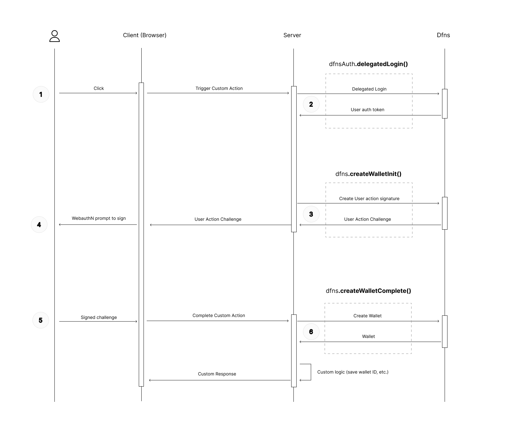

# Dfns SDK example - Nextjs Delegated Auth / Delegated Signing

This example showcases a setup where you have:

- Your server, communicating with Dfns
- A web-app (client-side), where your "end user" lives.

The server is the only party interacting with Dfns API (using the SDK).

In this situation, you (the server) don't want to be "in control" of the user's wallet. Essentially, after a wallet is created, you don't want to be able to initiate a transaction using the user's wallet, without the user signing-off on this action. So because of that, you (the server) shouldn't be legally considered the custodian.

When the server initiates a Wallet creation on behalf of the end-user, the server needs to have the user sign this action, otherwise it won't work.

The end user will sign the action from the web-app, using his WebauthN credentials. Your server will then relay his signature to Dfns, to complete the wallet's creation.

## Prerequisites

For this example to work, you need to complete a few prerequisites:

- On Dfns Dashboard, under `Settings` > `Applications`, create a new Dfns Application:
  - type: Client Side
  - Relying Party: localhost
  - Origin: http://localhost:3000
- On Dfns Dashboard, under `Settings` > `Service Account`, create a new Service Account (check [Dfns docs](https://docs.dfns.co/dfns-docs/advanced-topics/authentication/credentials/generate-a-key-pair) to see how to generate a public/private keypair)
- Copy/paste the `.env.example` into a `.env.local`, and replace with your environment variables values
  - `DFNS_API_BASE_URL`: Dfns api URL (eg https://api.dfns.ninja or https://api.dfns.io depending which you are using)
  - `DFNS_APPLICATION_ID` Application ID registered with Dfns above
  - `DFNS_APPLICATION_ORIGIN` Origin of Dfns Application created in step above, eg `http://localhost:3000`
  - `DFNS_SERVICE_ACCOUNT_TOKEN` Service Account token created above.
  - `DFNS_SERVICE_ACCOUNT_CREDENTIAL_ID`: Credential ID associated with the Service Account, when you created the service account. You can find this one in the `Dashboard` > `Settings` > `Service Account`
  - `DFNS_SERVICE_ACCOUNT_PRIVATE_KEY`: Private key of the credentials created for the service account. (the newlines in it should not be a problem)
  - `NEXT_PUBLIC_DFNS_WEBAUTHN_RPID` Relying party registered on the Dfns Application you created (in Dashboard go to `Settings` > `Applications`) to find it. It should be `localhost`.


## Run Example

At the root of the typescript-sdk repository (npm workspace), run:
```bash
npm i
```

Then go into this example and install as well:
```bash
cd packages/examples/nextjs-delegated
npm i
```

Then run the development server:
```bash
npm run dev
```

Open [http://localhost:3000](http://localhost:3000) with your browser to see the result, and follow the tutorial.

## Flow



## Server side

Build Dfns client:

```ts
// instanciate a key signer
const signer = new AsymmetricKeySigner({
  appOrigin: process.env.DFNS_APPLICATION_ORIGIN!,
  credId: process.env.DFNS_SERVICE_ACCOUNT_CREDENTIAL_ID!,
  privateKey: process.env.DFNS_SERVICE_ACCOUNT_PRIVATE_KEY!.replace(/\\n/g, '\n'),
})

// instanciate a dfns api client
const dfns = new DfnsApiClient({
  appId: process.env.DFNS_APPLICATION_ID!,
  baseUrl: process.env.DFNS_API_BASE_URL!,
  authToken: process.env.DFNS_SERVICE_ACCOUNT_TOKEN!,
  signer,
})
```

Delegated Login:

```ts
// call delegated login to get the user auth token
const { token: endUserAuthToken } = await dfns.auth.createDelegatedUserLogin({
  body: { username: body.email },
})
```

Wallet creation initiation (wallet owned by end user):

```ts
// instanciate a "delegated" dfns client
const dfnsDelegated = new DfnsDelegatedApiClient({
    appId: process.env.DFNS_APPLICATION_ID!,
    baseUrl: process.env.DFNS_API_BASE_URL!,
    authToken: endUserAuthToken,
  })

// call wallet creation initiation
const challenge = await dfnsDelegated.wallets.createWalletInit({
  body: { network: BlockchainNetwork.ETH_GOERLI },
})

// send this challenge to be signed by the enduser (client-side).
// ...
```

Complete Wallet creation:

```ts
const body = (await request.json()) as {
  request: CreateWalletRequest
  challenge: UserActionChallengeResponse
  signedChallenge: SignUserActionChallengeRequest
}

// ...

// complete wallet creation
const wallet = await dfnsDelegated.wallets.createWalletComplete(body.request, body.signedChallenge)
```


Get end user wallets:

```ts
const { items: wallets } = await dfnsDelegated.wallets.listWallets({})
```

## Client side

Here's the client-side code for the wallet creation:

```ts
import { WebAuthn } from '@dfns/sdk-webauthn'

const createWallet = () =>
  // 1. Call server-side wallet creation initiation,
  fetch('/api/wallets/create/init', { method: 'POST' }).then(async (result) => {
    const { request, challenge } = await result.json()

    // 2. Then sign the returned challenge with WebauthN credentials
    const webauthn = new WebAuthn({ rpId: process.env.NEXT_PUBLIC_DFNS_WEBAUTHN_RPID! })
    const assertion = await webauthn.sign(challenge.challenge, challenge.allowCredentials)

    // 3. Call server-side wallet creation completion with signed challenge
    return fetch('/api/wallets/create/complete', {
      method: 'POST',
      body: JSON.stringify({
        request,
        signedChallenge: {
          challengeIdentifier: challenge.challengeIdentifier,
          firstFactor: assertion
        },
      }),
    })
  })
```